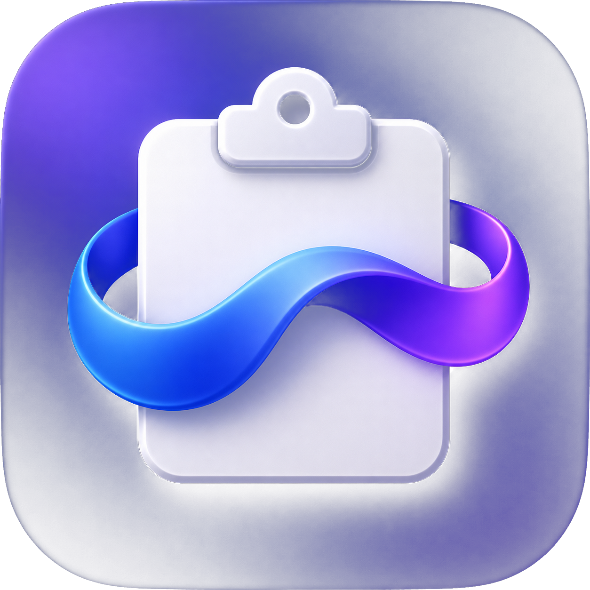

<p align="center">
  
</p>

<h1 align="center">ClipFlow</h1>

<p align="center">
  <strong>The Ultimate Cross-Platform Clipboard Companion 📋✨</strong><br>
  Never lose a copied text, link, image, or snippet again. Blazing fast, local-first, and beautiful.<br>
  <em>Native support for macOS, Windows (Beta), iOS (Beta), & Android (Beta).</em>
</p>

<p align="center">
  <a href="https://github.com/vqh2602/paste_plus/releases/latest">
    
  </a>
  
  
  
  
  
  <a href="PRIVACY_POLICY.md">
    
  </a>
  <a href="LICENSE">
    
  </a>
</p>

---

## 🌟 Why You'll Love ClipFlow

**ClipFlow** turns your clipboard into an intelligent workspace. Built with native desktop aesthetics in mind, ClipFlow lives silently in your System Tray / Menu Bar and pops up instantly whenever you need your history.

### ⚡ Key Selling Points
- 🚀 **Instant Auto-Paste**: Summon the horizontal Quick Panel under your cursor and paste directly into any active app.
- 🔐 **Biometric Encrypted Vault**: Secure confidential snippets and images with Touch ID, Face ID, Windows Hello, or Master Password (AES-256-GCM).
- 🛡️ **Zero-Leak Privacy**: Proactively filters payment cards (Luhn check), national IDs, password fields, and hides windows from screen capture.
- 🌐 **Local LAN Sync**: Real-time TLS-encrypted sync for history, pinned items, and collections across devices on your local Wi-Fi.
- 🧰 **Built-in Power Utilities**: One-click JSON formatting, tracking link cleaner, inline math solver, color converter, and text transformations.
- 🤖 **100% On-Device AI & OCR**: Local GGUF models for offline chat/summarization and native OCR to extract text from images.

---

## 🔥 Feature Highlights

| Category | Feature | Description |
|---|---|---|
| **⚡ Productivity** | **Floating Quick Panel** | Press `Control+V` (macOS) / `Ctrl+Shift+V` (Windows) anywhere for a sleek horizontal paste bar right under your cursor. |
| | **Auto-Paste** | Instantly pastes selected items back into the frontmost app via native keyboard simulation. |
| | **Drag to Collections** | Organize snippets by dragging cards directly into sidebar folders with interactive hover states. |
| | **Guided Smart Search** | Live search syntax suggestions (`type:`, `app:`, `note:`, `is:pinned`, `after:`) in both Main Window and Quick Panel. |
| **🧰 Smart Utilities** | **Text Transformations** | Pretty-print/minify JSON, Base64 & URL encode/decode, case converters, Unix timestamps, MD5 hash, sort & deduplicate lines. |
| | **Link Cleaner** | Automatically strip marketing and tracking query parameters (`utm_*`, `fbclid`, `gclid`) while keeping essential URLs intact. |
| | **Math & Smart Detect** | Inline math evaluation plus auto-detection for JWT tokens, colors, phone numbers, and programming code blocks. |
| | **Color Converter** | Dynamic color parser supporting live conversions across **HEX**, **RGB**, **HSL**, **HSV**, and **CMYK**. |
| **🔐 Privacy & Security** | **Biometric Secure Vault** | Keep sensitive snippets in an AES-256-GCM encrypted vault (PBKDF2 210k rounds); excluded from search, AI, cleanup, and sync. |
| | **Sensitive Data Shields** | Automatic filtering for payment cards (Luhn algorithm), national IDs/passports, OTP codes, and API keys. |
| | **Window & Password Shield** | Ignores clipboard copying when focused on password fields (`ES_PASSWORD`) or sensitive banking/auth windows. |
| | **Screen Capture Privacy** | Hides ClipFlow windows from OS screenshots, screen recordings, and screen-sharing sessions. |
| **🤖 AI & Vision** | **Local GGUF AI Assistant** | Run offline LLMs (Qwen, Gemma, DeepSeek) for contextual chat, translation, summarization, and code rewriting. |
| | **Native Vision & OCR** | Extract text from copied screenshots and images via on-device OCR (Apple Vision / MLKit). |
| | **Optional Cloud Upload** | One-click image upload to ImgBB or FreeImage.host with encrypted API key management. |
| **🔄 Sync & Backup** | **TLS Local LAN Sync** | Real-time encrypted peer-to-peer sync for history, pins, and collections with complete drain sync and auto-reconnect. |
| | **Encrypted `.clipflow` Archive** | Export/import full workspace backups (history, settings, collections, images) with AES-256-GCM encryption. |
| **🎨 Customization** | **Themes & Dark Mode** | 15+ rich themes (Emerald Mint, Cyber Violet, Sunset Orange, Pastel accents) with full Dark Mode support. |
| | **Multi-Language** | Instant interface switching across 6 languages: Vietnamese, English, Japanese, Korean, German, and Simplified Chinese. |
| | **Retention Control** | Customizable retention (1 day, 7 days, 30 days, 1 year, or unlimited) with automated image cleanup. |

---

## 🎯 Clipboard Context Menu & Quick Actions

ClipFlow provides a native macOS-style popup menu on every clipboard item (click the `···` button or right-click) and on the Detail Pane toolbar:

```
┌────────────────────────────────────────────────────────┐
│  ↗ Open Link                          (URLs only)      │
│  📄 Paste as Plain Text               (Rich / Text)    │
│  📋 Copy                                               │
│ ────────────────────────────────────────────────────── │
│  🔀 Text Transformations              ▶ (Submenu)      │
│     ├─ Format JSON (Beautify)                          │
│     ├─ Minify JSON (Compact)                           │
│     ├─ Encode / Decode Base64                          │
│     ├─ Encode / Decode URL                             │
│     ├─ UPPERCASE / lowercase / Title Case              │
│     ├─ Parse Unix Timestamp                            │
│     ├─ MD5 Hash                                        │
│     ├─ Sort Lines Alphabetically                       │
│     └─ Remove Duplicate Lines                          │
│  🎨 Convert Color                     ▶ (Submenu)      │
│     └─ HEX ⇄ RGB ⇄ HSL ⇄ HSV ⇄ CMYK                   │
│  🧹 Link Cleaner                      (Strip tracking) │
│ ────────────────────────────────────────────────────── │
│  ✏️ Edit Clipboard                    (Text/Color/Img) │
│  📝 Add / Edit Note                   (Search by note:)│
│  🔍 Extract Text (OCR)                (Images only)    │
│  ☁️ Upload to Cloud                   (ImgBB/FreeImage)│
│  🌐 Translate Text                    (6 Languages)    │
│  ✨ Ask AI Assistant                  (Local GGUF LLM) │
│ ────────────────────────────────────────────────────── │
│  📌 Pin / Unpin Item                  (Never expires)  │
│  📁 Add to Collection / Move to Vault                  │
│  👁️ Full Preview                     (Fullscreen/Zoom)│
│  📤 Share Clipboard                   (Native OS Share)│
│  🗑️ Delete                            (Destructive)    │
└────────────────────────────────────────────────────────┘
```

### Detailed Action Breakdown:
- **↗ Open Link**: Automatically detects URLs and opens them directly in your default browser.
- **📄 Paste as Plain Text**: Strips rich text, styling, fonts, and HTML formatting, auto-pasting pure plain text straight into the target app.
- **🔀 Text Transformations (Submenu)**: Pure local operations that generate a new clipboard item without altering the original:
  - **Format / Minify JSON**: Formats messy JSON with indentation or compresses it to a single line.
  - **Base64 Encode / Decode**: Instant encoding and decoding of Base64 strings.
  - **URL Encode / Decode**: Escape or unescape special URI characters.
  - **Case Converters**: Toggle text between `ALL CAPS`, `lowercase`, and `Title Case`.
  - **Unix Timestamp**: Converts epoch seconds/milliseconds into a human-readable local date & time.
  - **MD5 Hash**: Calculates an MD5 hash digest on copied text.
  - **Line Sorter & Deduplicator**: Sorts text lines alphabetically or purges duplicate rows.
- **🎨 Convert Color (Submenu)**: Dynamic color parser supporting live conversion across **HEX**, **RGB**, **HSL**, **HSV**, and **CMYK**.
- **🧹 Link Cleaner**: Strips UTM tags, marketing trackers, `fbclid`, `gclid`, and analytics query strings while preserving routing and functional parameters.
- **✏️ Edit Clipboard**: In-app editor allowing you to alter text snippets, tweak color values, or rotate copied images prior to saving.
- **📝 Attach & Edit Notes**: Attach personal notes to any item; search by syntax `note:keyword` anytime.
- **🔍 Extract Text (OCR)**: On-device optical character recognition (Apple Vision on macOS / MLKit) to pull text out of screenshots and photos.
- **☁️ Upload to Cloud**: Explicit one-click upload to ImgBB or FreeImage.host with secure local API key storage.
- **🌐 Translate Text**: Instant offline or AI translation into English, Vietnamese, Japanese, Korean, German, or Chinese.
- **✨ Ask AI Assistant**: Opens the on-device AI workspace with the selected item already attached as conversational context.
- **📁 Add to Collection / Move to Vault**: Organize items into custom folders or transfer confidential records into the Biometric Encrypted Vault.
- **👁️ Fullscreen Preview**: Detailed inspect modal with text zooming, image dimension display, and aspect ratio controls.
- **📤 Native OS Share**: Intelligently routes data to system share targets based on payload (URL, file list, image, or text).

---

## 🚀 Quick Start & Installation

### Option 1: Download Pre-built Release (Recommended)
1. Head over to [**GitHub Releases**](https://github.com/vqh2602/paste_plus/releases/latest).
2. Download the artifact for your platform: `ClipFlow-macOS.zip`, `ClipFlow-Windows.zip`, `ClipFlow-Android.apk`, or the unsigned `ClipFlow-iOS.ipa` beta payload.
3. **macOS**: Unzip and drag `ClipFlow.app` into your **Applications** folder. Grant Accessibility Permission in *System Settings > Privacy & Security > Accessibility* for Auto-Paste.
4. **Windows (Beta)**: Extract the ZIP archive and run `clipflow.exe`.
5. **Android (Beta)**: Allow installation from the selected source, then install `ClipFlow-Android.apk`.
6. **iOS (Beta)**: The release artifact is unsigned and must be signed/sideloaded with your own Apple development setup before installation.

> **iOS and Android are currently Beta.** GitHub release artifacts and source builds are available, but mobile behavior remains subject to each operating system's clipboard/background-access restrictions. Store packages are not advertised as stable releases yet.

### Option 2: Build From Source

```bash
# Clone repository
git clone https://github.com/vqh2602/paste_plus.git
cd paste_plus

# Install dependencies
flutter pub get

# Run on macOS
flutter run -d macos

# Run on Windows (Beta)
flutter run -d windows

# Run on iOS (Beta, requires macOS + Xcode)
flutter run -d ios

# Run on Android (Beta)
flutter run -d android
```

### Platform Status

| Platform | Status | Notes |
|---|---|---|
| macOS | Stable | Full clipboard watcher, Quick Panel, global shortcuts, auto-paste, OCR, tray, and updater support. |
| Windows | Beta | Native clipboard watcher, Quick Panel, global shortcuts, auto-paste, tray, and updater support. |
| iOS | Beta | Mobile UI and foreground clipboard workflows; behavior remains subject to iOS clipboard/background policies. |
| Android | Beta | Mobile UI and foreground clipboard workflows; behavior remains subject to Android background and vendor restrictions. |

---

## ⌨️ Shortcuts Cheat Sheet

| Action | macOS Shortcut | Windows (Beta) Shortcut |
|---|---|---|
| **Summon Quick Panel** | `Control + V` (`⌃V`) | `Ctrl + Shift + V` |
| **Navigate Snippets** | `↑` `↓` `←` `→` Arrows | `↑` `↓` `←` `→` Arrows |
| **Copy & Auto-Paste** | `Enter` / `Return` | `Enter` |
| **Focus Search Bar** | `⌘ + F` | `Ctrl + F` |
| **Pin / Unpin Snippet** | `⌘ + P` | `Ctrl + P` |
| **Delete Snippet** | `⌘ + Delete` | `Delete` / `Ctrl + D` |
| **Dismiss Panel** | `Esc` | `Esc` |

---

## 🛠️ Developer Architecture & Technical Documentation

Are you a developer, contributor, or curious about how ClipFlow works under the hood?

We maintain complete technical documentation covering multi-platform data flows, SQLite database engines (`sqflite` & `sqflite_common_ffi`), local GGUF AI engines (`llamadart`), native platform channels, Win32 / AppleScript integrations, and CI/CD pipelines in a separate dedicated document:

👉 [**Read Technical Architecture & Developer Guide (`ARCHITECTURE.md`)**](ARCHITECTURE.md)

---

## 📄 License & Privacy Policy

- 📜 **Software License**: Distributed under the **MIT License**. See [**`LICENSE`**](LICENSE) for details.
- 🛡️ **Privacy Policy**: 100% Local-First. Read our full policy in [**`PRIVACY_POLICY.md`**](PRIVACY_POLICY.md).

---

<p align="center">
  Crafted with ❤️ for clipboard power users across desktop and mobile. Star ⭐️ this repo if ClipFlow boosts your daily workflow!
</p>
